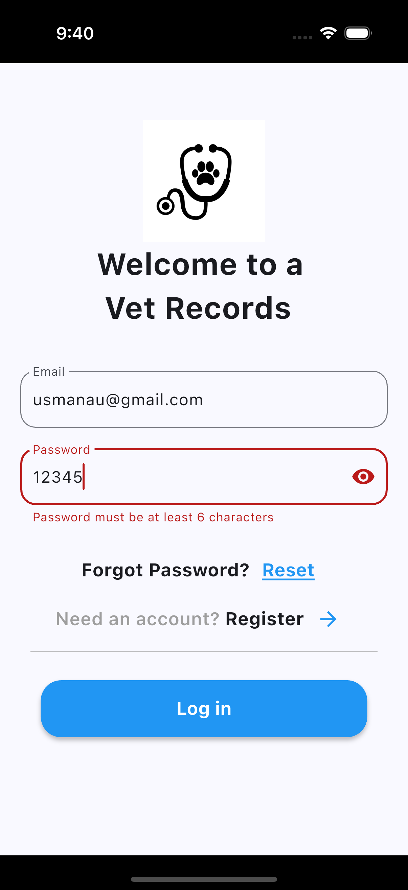

# Simple Flutter Login Authentication

A basic Flutter application implementing login authentication with email and password input validation.

## Overview

This Flutter project demonstrates a simple login screen with the following features:

* Email and password input fields.
* Real-time validation of email format and password complexity/length.
* A "Log in" button to trigger the authentication process (you'll need to implement the actual backend logic).
* Basic UI elements for a clean login experience.
* Includes a "Forgot Password?" and "Need an account?" section with placeholder actions.

## Screenshots

The application screenshots are available in the `screenshots` folder.

* **demo1.png:** Initial login screen with empty fields.
* **all_error.png:** Login screen showing email validation error.
* **password_error.png:** Login screen showing password validation error.
* **password_error2.png:** Login screen showing password less than 6 characters.
* **password_error3.png:** Login screen showing password must have at least one character, uppercase and a number.
* **success.png:** Login screen after successful (client-side) validation.

<p float="left">
  
  
  
  
  
  
</p>  

## Project Structure
```plaintext
├── android/
├── ios/
├── lib/
│   ├── main.dart           # Main application entry point
│   └── widgets/          # Contains custom widgets
│       └── login_screen.dart # The login screen widget
├── screenshots/          # Contains project screenshots
│   ├── screenshot_1.png
│   ├── screenshot_2.png
│   ├── screenshot_3.png
│   └── screenshot_4.png ...
├── test/
└── ... other Flutter project files ...

```
## Getting Started

To run this application on your local machine, you need to have Flutter installed.

1.  **Clone the repository:**

    ```bash
    git clone https://github.com/Asante-Adarkwa-Usman/flutter_ui_assignment
    
    cd test_project
    ```

2.  **Get dependencies:**

    ```bash
    flutter pub get
    ```

3.  **Run the application:**

    ```bash
    flutter run
    ```

## Implementation Details

* **Stateful Widget:** The login screen is implemented as a `StatefulWidget` (`LoginScreen`) to manage the state of the input fields and password visibility.
* **Form Validation:** A `GlobalKey<FormState>` is used to manage the form and trigger validation.
* **`TextFormField`:** The email and password inputs are handled using `TextFormField` widgets.
* **Email Validation:** The email input uses a regular expression (`RegExp`) to ensure a valid email format.
* **Password Validation:** The password input validates for minimum length and includes checks for at least one uppercase letter, one lowercase letter, and one number using a regular expression.
* **Password Visibility:** A toggle icon allows the user to show or hide the password.
* **Basic UI:** The layout uses `SafeArea`, `Scaffold`, `Center`, `Column`, `Row`, `SizedBox`, `Image`, `Text`, `TextButton`, `ElevatedButton`, and `Divider` widgets for a basic user interface.
* **Placeholder Actions:** The "Forgot Password?" and "Need an account?" sections have `TextButton` and `IconButton` widgets with empty `onPressed` callbacks, indicating where you would implement those functionalities.
* **Successful Validation Feedback:** A `SnackBar` is displayed upon successful client-side validation (you'll replace this with actual authentication logic).

## Next Steps (To Implement)

To make this a fully functional login application, you will need to implement the following:

* **Backend Integration:** Connect the "Log in" button's `onPressed` callback to your authentication backend (e.g., using HTTP requests to an API).
* **User Authentication:** Implement the logic to send the entered email and password to your backend for verification.
* **Error Handling:** Handle potential errors during the authentication process (e.g., incorrect credentials, network issues) and display appropriate feedback to the user.
* **Navigation:** Upon successful authentication, navigate the user to the main part of your application.
* **"Forgot Password" Functionality:** Implement the logic for users to reset their passwords.
* **"Register" Functionality:** Implement the logic for new users to create an account.
* **State Management:** For a more complex application, consider using a state management solution (like Provider, BLoC/Cubit, Riverpod) to manage the authentication state and user session.
* **Secure Storage:** For persistent user sessions, securely store authentication tokens.

